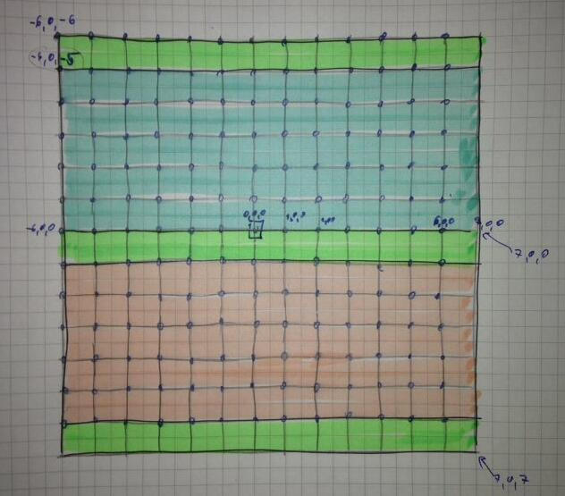

# AVT7
Three-Dimensional Vizualization and Animation at IST

## Projects from previous years
- https://github.com/carboned4/AVT_2016_1
- https://github.com/carboned4/CeGue
- https://github.com/SirMastermind/CG1415-Frogger (developed in XCode)

Also contains includes for both OSX and Win:


``` c++
#ifdef __APPLE__
    #include <OpenGL/gl.h>
    #include <OpenGL/glu.h>
    #include <GLUT/glut.h>
#else
    #ifdef _WIN32
    #include <windows.h>
#endif
#include <GL/gl.h>
#include <GL/glu.h>
#include <GL/glut.h>
#endif
```
- https://github.com/jmsfilipe/avt-frogger-opengl
- https://github.com/dtcpatricio/avt

## Libs installation
``` bash
# TinyXML
sudo apt-get install libtinyxml-dev

# DevIL
sudo apt install libdevil-dev

# Assimp
sudo apt-get install libassimp-dev assimp-utils
sudo apt-get install libxmu-dev libxi-dev
```

## Frogger map
Note that the object are created from their (top, left, bottom) corner. Each object is therefore not centered in the middle. The collider is centered, however if all of them are shifted in the same way, it is not an issude. This hack saves a some struggle when translating scaled objects. 


